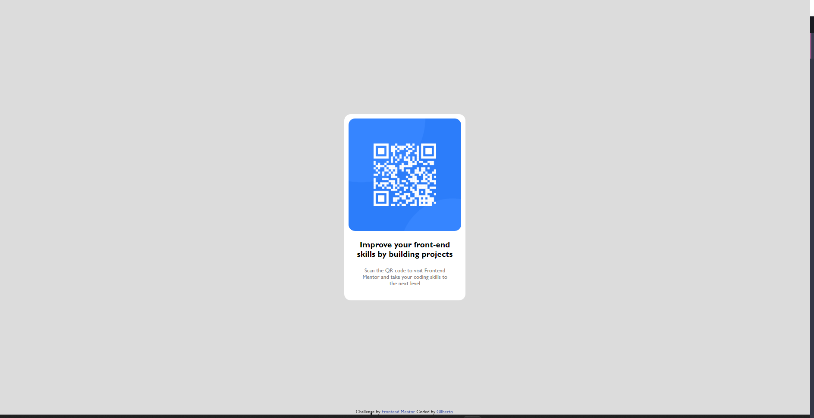

# Frontend Mentor - QR code component solution

This is a solution to the [QR code component challenge on Frontend Mentor](https://www.frontendmentor.io/challenges/qr-code-component-iux_sIO_H). Frontend Mentor challenges help you improve your coding skills by building realistic projects. 

### Screenshot

### Links

- Solution URL: [Add solution URL here](https://github.com/Gibasa/qr-code)
- Live Site URL: [Add live site URL here](https://gibasa.github.io/qr-code/)

### Built with

- Semantic HTML5 markup
- CSS custom properties
- Flexbox
- Mobile-first workflow

## Author

- [Gilberto](https://github.com/Gibasa)
- Frontend Mentor - [@yourusername](https://www.frontendmentor.io/profile/yourusername)